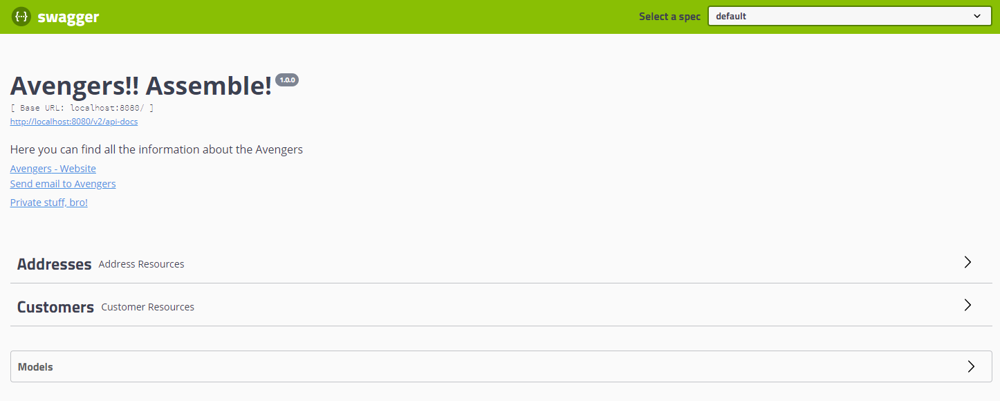

# Custumer Service

### Tecnologias Utilizadas

1. JDK 11
2. Maven 3
3. OpenFeign
4. Flyway
5. Swagger / Swagger UI
6. Lombok (Foi adicionado um arquivo de configuração para o plugin do lombok **lombok.config**)
7. Docker (Arquivos de configuração para criação de imagem e container). Foram adicionados dois arquivos de build do docker à raiz do projeto, Dockerfile e docker-compose.yaml

### Instalação

- Para instalar o projeto, basta executar o comando abaixo na raiz do projeto:

```sh 
  docker build -f Dockerfile --tag example-api:latest .
```
Após a execução do comando acima, será criada uma imagem com o nome **example-api** e a tag **latest**.

- Para executar o container, basta executar o comando abaixo:

```sh 
  docker run -p 8080:8080 example-api:latest
```

- Para instalar o projeto via docker-compose, basta executar o comando abaixo na raiz do projeto:

```sh 
  docker-compose -f docker-compose.yaml up -d
```

**Obs**: A configuração do dockerfile é multi-stage, ou seja, ele é responsável por compilar o projeto e gerar o pacote .jar. Não sendo necessário ter o java, maven ou qualquer outra dependência instalada na máquina. Apenas o docker.


### Documentação

- Para acessar a documentação da API, basta acessar o link abaixo:

```sh 
  http://localhost:8080/swagger-ui.html
```


